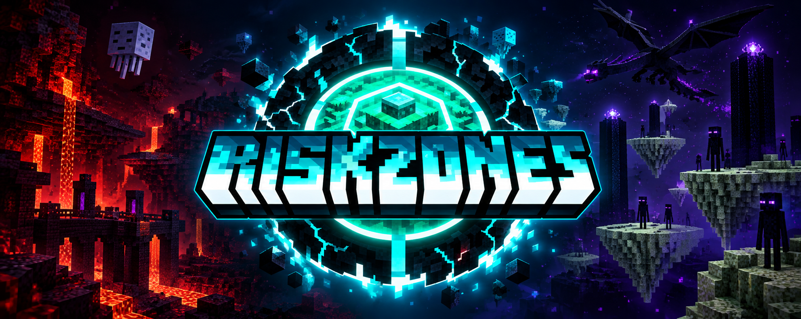

<p align="center">
  
</p>

<p align="center">
  <a href="LICENSE.md"></a>
  
  
  <a href="https://t.me/danilka_pikaso"></a>
  <a href="https://github.com/AsQqqq"></a>
</p>

<h3 align="center">RiskZones</h3>
<p align="center">Риск начинается за чертой</p>

<p align="center">
  <a href="#возможности">Возможности</a> ·
  <a href="#установка">Установка</a> ·
  <a href="docs/CONFIGURATION.md">Полный референс конфига</a>
</p>

---

RiskZones - Paper-плагин, который делит миры на произвольное число
**кастомных зон риска** вокруг настраиваемого центра. Чем дальше от
центра - тем опаснее: полёт отключается, скорость и размер честно
сбрасываются к ванильным значениям (никаких донат-преимуществ), часть
команд блокируется, а PvP остаётся без пощады. Сколько зон, где их
границы и что в каждой происходит - решает админ в `config.yml`

Игрок не попадает в опасность вслепую - плагин заранее предупреждает о
приближении к границе (чат/action-bar/title/звук, всё настраивается
отдельно для каждой зоны).

## Возможности

- **Произвольные зоны-кольца** вокруг центра каждого мира, с проверкой
  конфига на пересечения и корректность бесконечной внешней зоны
- **Честный сброс** скорости ходьбы, полёта и размера персонажа - не
  разово при входе, а постоянно, пока игрок в зоне, так что переналожить
  баф не выйдет
- **Блокировка команд** (телепорты и что угодно ещё) со своим списком и
  сообщением на каждую зону
- **Предупреждение о приближении** к границе - по расстоянию, с
  повторами и полным набором каналов уведомления
- **Все тексты и цвета - в конфиге**, ни одной жёстко зашитой строки;
  системные сообщения команды `/riskzones` - в `lang/ru.yml`/`lang/en.yml`
- **Публичный API и событие** `RiskZoneChangeEvent` для интеграции с
  донат/ролевыми плагинами

<p align="center">
  
</p>

## Установка

```bash
mvn clean package
```

Готовый джарник - `target/riskzones-plugin-1.0.0.jar`, кладётся в
`plugins/`. При первом запуске сгенерируется `plugins/RiskZones/config.yml`
и папка `plugins/RiskZones/lang/` с файлами перевода

Требуется Java 21 и Paper 1.21.x (форки вроде Leaf тоже подходят - код не
использует NMS/internals, только публичный Paper API)

## Настройка

Всё - в `config.yml`, зона за зоной. Полный референс всех полей
(`from`/`to`, ограничения, тексты, предупреждения, права) - в
**[docs/CONFIGURATION.md](docs/CONFIGURATION.md)**

## Лицензия

[MIT](LICENSE.md) - делай что хочешь, форкай, меняй под свой сервер

---

<p align="center"><sub>Разработано <b>Danya</b> · <a href="https://t.me/danilka_pikaso">Telegram</a> · <a href="https://github.com/AsQqqq">GitHub</a></sub></p>
